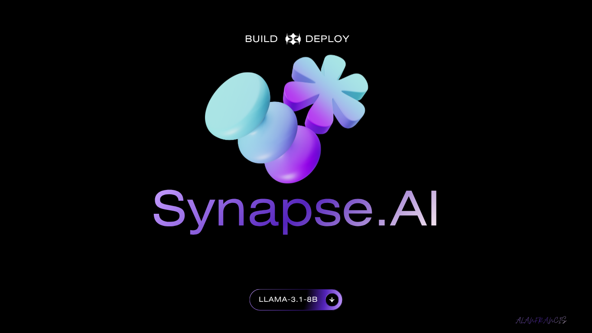

# Synapse.AI

     

## 📑 Table of Contents

- [Description](#description)
- [Tech Stack](#tech-stack)
- [Quick Start](#quick-start)
- [Key Dependencies](#key-dependencies)
- [Project Structure](#project-structure)
- [Development Setup](#development-setup)
- [Contributing](#contributing)
- [License](#license)

## 📝 Description

Synapse.AI — a software project built with Python.

## 🛠️ Tech Stack

- 🐍 **Python**

## ⚡ Quick Start

```bash

# 1. Clone the repository
git clone https://github.com/alanfrancis765/Synapse.AI.git

# 2. Create & activate a virtualenv
python -m venv venv && source venv/bin/activate

# 3. Install dependencies
pip install -r requirements.txt
```

## 📦 Key Dependencies

```
streamlit: 1.35.0
groq: 0.9.0
python-dotenv: latest
firebase-admin: latest
requests: latest
```

## 📁 Project Structure

```
.
├── .devcontainer
│   └── devcontainer.json
├── LICENSE
├── LLM.py
├── app.py
├── backend
│   ├── __init__.py
│   └── auth_backend.py
└── requirements.txt
```

## 🛠️ Development Setup

### Python
1. Install Python (v3.10+ recommended)
2. `python -m venv venv && source venv/bin/activate`  (Windows: `venv\Scripts\activate`)
3. `pip install -r requirements.txt`

## 👥 Contributing

Contributions are welcome! Here's the standard flow:

1. **Fork** the repository
2. **Clone** your fork: `git clone https://github.com/alanfrancis765/Synapse.AI.git`
3. **Branch**: `git checkout -b feature/your-feature`
4. **Commit**: `git commit -m 'feat: add some feature'`
5. **Push**: `git push origin feature/your-feature`
6. **Open** a pull request

Please follow the existing code style and include tests for new behavior where applicable.

## 📜 License

This project is licensed under the **MIT** License.

---
*This README was generated with ❤️ by [ReadmeBuddy](https://readmebuddy.com)*
